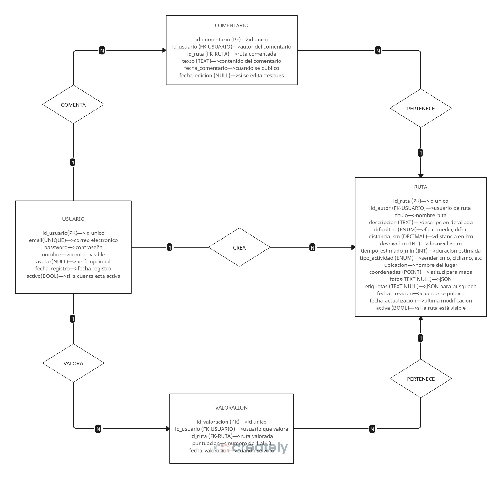

# **SendaLite**

## LOGO

  

**Descripción del logo:**  

El logo representa una **chincheta de ubicación** sobre una **montaña**, simbolizando la idea de marcar rutas y destinos en entornos naturales.

## Integrantes

- **David Gragera Fernández** — DNI: 80085386F  
  

- **Shunya Zhan** — DNI: Y1346365M  
  

## Eslogan

*“Explora. Valora. Comparte”*

## Resumen

Aplicación web minimalista para amantes de la montaña y el senderismo en general.

## Descripción

La idea es que nuestra app, **SendaLite**, sea una aplicación web ligera y minimalista para descubrir y compartir rutas al aire libre, ya sea montaña o senderos.  

Permitirá a los usuarios:

- Consultar rutas clasificadas por **dificultad** (fácil, media, difícil).  
- Ver detalles (distancia, desnivel y mapa).  
- Valorar con una **puntuación del 1 al 10**.  
- Los usuarios autenticados podrán **crear, editar y eliminar** sus rutas, así como **puntuar rutas de otros**.  

## Funcionalidades, Requisitos, “Pliego de condiciones”

### Ver listado de rutas

- La pantalla principal mostrará todas las rutas disponibles en formato de **tarjetas o lista**.  
- Cada ruta incluirá información básica para facilitar una preselección rápida.  

### Filtrar rutas por dificultad

- Filtrado por **fácil**, **media** y **difícil**.

### Ver ficha de ruta

Pantalla detallada con la información de una ruta específica, similar a una ficha técnica:

- **Título y descripción:** información general.  
- **Mapa:** ubicación geográfica con posible trazado.  
- **Datos técnicos:** distancia, desnivel, tiempo estimado.  
- **Galería de fotos:** imágenes de referencia.  
- **Información del autor:** quién compartió la ruta.  
- **Historial:** fechas de creación y actualización.  
- **Sistema de valoraciones:**  
  - Solo usuarios registrados pueden votar.  
  - Escala de **1 a 10** (10 es excelente).  
  - **Puntuación media** calculada automáticamente.  
  - **Transparencia:** se muestra cuántas personas han votado.  

### Registro e inicio de sesión (email + contraseña)

- Sistema de autenticación tradicional.  
- Email y contraseña obligatorios.  
- Tras loguearse, acceso al resto de funcionalidades.  

### Perfil de usuario

Espacio personal donde cada usuario gestiona su identidad y contenido:  
- **Información pública:** nombre visible y avatar (opcional).  
- **Estadísticas:** número de rutas creadas y valoraciones realizadas.  

### Crear ruta (usuarios autenticados)

- Formulario con campos obligatorios y opcionales.
- Confirmación de publicación ************  

### Editar/eliminar rutas propias

- Solo el **autor** o el administrador puede editar o eliminar sus rutas.  

### Búsqueda por texto

Motor de búsqueda con varios criterios:  
- **Nombre:** palabras clave en el nombre.  
- Dificultad
- Actividad
- Kms
- 
- **:** zona geográfica o nombre del lugar.  
- **:** palabras clave asociadas (montaña,     bosque, etc.).  

## Funcionalidades opcionales, recomendables o futuribles


- Ordenar por puntuación media (desc/asc) y por más recientes.  
- Formularios con validaciones avanzadas y subida de fotos.  
- Mapas interactivos.  
- Búsqueda por ubicación y/o etiquetas.  
- Ver rutas del propio usuario (**Mi cuenta**).  
- Gestión básica de errores (404, 500) y mensajes de validación.  
- Marcar ruta como favorita.  
- Comentarios en rutas.

## Diagrama Entidad - Relación


## Arrancar la base de datos con Docker (MySQL)

Este repositorio incluye un `docker-compose.yml` preparado para levantar una instancia de MySQL y Adminer para administración.

Pasos rápidos:

1. Arrancar los servicios:

   docker compose up -d

   (o `docker-compose up -d` si tu versión de Docker lo requiere).

2. Variables por defecto (fijadas en `docker-compose.yml`):

   - MYSQL_DATABASE=sendalite
   - MYSQL_USER=sendalite
   - MYSQL_PASSWORD=sendalite
   - MYSQL_ROOT_PASSWORD=root

3. El directorio `docker/mysql/init/` contiene los scripts `01_schema.sql` y `02_seed.sql` que se ejecutarán en el primer arranque y crearán la estructura y datos iniciales. También hay un archivo my.cnf para configurar la base de datos (acentos, ñ).

4. Para acceder a la base de datos desde Adminer: abre http://localhost:8081 y conéctate a `sendalite` usando las credenciales anteriores.

Nota: la aplicación por defecto (archivo `src/main/resources/application.properties`) está configurada para MySQL en `jdbc:mysql://localhost:3306/sendalite`.

## Ejecutar tests

- Los tests unitarios/DB usan H2 embebida (`@DataJpaTest`) por lo que no es necesario tener Docker corriendo para ejecutar `mvn test`.

- Ejecutar la suite desde la raíz del proyecto con el wrapper de Maven:

```sh
./mvnw test
```

o con Maven instalado:

```sh
mvn test
```

- Si quieres ejecutar la aplicación contra la base de datos MySQL arrancada con Docker, arranca los contenedores y luego lanza la aplicación (por ejemplo desde tu IDE) usando las credenciales del `application.properties`.

## Ejecutar la aplicación Spring Boot (Maven)

Problema común: PowerShell puede responder "'.\mvnw.cmd' no se reconoce..." al ejecutar:
.\mvnw.cmd spring-boot:run

Soluciones rápidas:
1. Asegúrate de estar en la carpeta raíz del proyecto (la que contiene `pom.xml`).
2. Si el wrapper existe (mvnw.cmd, mvnw, .mvn/wrapper), ejecuta desde la raíz del proyecto:

   ```powershell
   .\mvnw.cmd spring-boot:run -DskipTests
   ```

3. Si no existe el wrapper pero tienes Maven instalado:
   ```powershell
   mvn spring-boot:run -DskipTests
   ```

4. Si no tienes mvn ni wrapper, instala Maven: https://maven.apache.org/install.html

Helper incluido:
- `run-maven.ps1`: detecta `mvnw.cmd` o `mvn` y ejecuta `spring-boot:run` automáticamente.
  Uso desde la raíz del proyecto:

```powershell
.\run-maven.ps1
```

## Notas rápidas sobre cambios UI recientes

He aplicado una serie de mejoras front-end para hacer la ficha de ruta más clara y agradable visualmente. Aquí tienes un resumen de lo que se ha añadido y cómo probarlo localmente:

- Avatares genéricos:
  - Archivo: `src/main/resources/static/img/avatar-default.svg`
  - Uso: se muestra un avatar genérico junto a cada comentario y cada valoración.

- Valoración media como estrellas + número:
  - En la ficha de ruta y en el listado de rutas (index) la valoración se muestra con hasta 5 estrellas (rellenas proporcionalmente) y el número formateado (ej. ★★★★☆ 4.2).
  - Renderizado: el número se calcula en el servidor (Thymeleaf) y la representación de estrellas se genera en cliente con JavaScript (`renderAllStars()`)

- Subida de foto (placeholder):
  - En la ficha de ruta aparece un botón `Subir foto (placeholder)` visible sólo para usuarios autenticados.
  - Comportamiento: abre el selector de archivos del navegador pero no sube nada (sólo muestra un alert). Sirve como placeholder para integrar el backend posteriormente.

- 'Leer más' en la descripción:
  - Descripciones largas se muestran truncadas (≈280 caracteres) y se pueden expandir contraer con el enlace `Leer más` / `Leer menos`.

- Logo con fallback:
  - El navbar intenta cargar `src/main/resources/static/img/logo/logo.png`. Si la imagen no existe o está rota, se oculta automáticamente y se muestra el texto `SendaLite` como fallback.

- Archivos modificados (resumen):
  - `src/main/resources/templates/ruta.html` — avatares, estrellas, upload placeholder, read-more
  - `src/main/resources/templates/index.html` — estrellas en la lista de rutas
  - `src/main/resources/templates/fragments/common.html` — restaurado logo con fallback en `onerror`
  - `src/main/resources/static/css/style.css` — estilos para avatar, estrellas, read-more y upload placeholder
  - `src/main/resources/static/img/avatar-default.svg` — nuevo recurso SVG (avatar genérico)

Cómo probarlo localmente (Windows PowerShell)

1. Arranca la aplicación (desde la raíz del proyecto):

```powershell
.\mvnw.cmd -DskipTests spring-boot:run
```

2. Abrir en el navegador:
   - Listado de rutas: http://localhost:8080/
   - Ficha de una ruta: http://localhost:8080/rutas/{id} (sustituye {id} por una ruta existente)

3. Pruebas rápidas:
   - Comentarios: verifica que aparece el avatar a la izquierda de cada comentario.
   - Valoración media: comprueba que se ven estrellas y el número (si la ruta tiene valoraciones en la BD).
   - Subida placeholder: si estás autenticado, pulsa `Subir foto (placeholder)` y selecciona un archivo — aparecerá un mensaje indicando que es un placeholder.
   - Leer más: en descripciones largas, haz click en `Leer más` para expandir/contraer.
   - Logo: renombra temporalmente `src/main/resources/static/img/logo/logo.png` (si existe) y recarga la página; la imagen se ocultará y aparecerá el texto `SendaLite`.

CSRF (nota para desarrollo)

- El front-end utiliza meta tags `_csrf` y `_csrf_header` inyectadas por Thymeleaf. Para peticiones AJAX se intenta usar primero el token meta y, si no existe, la cookie `XSRF-TOKEN`.
- Si ves errores 403 en operaciones AJAX, asegúrate de que el navegador tenga la cookie `XSRF-TOKEN` o que la meta `_csrf` esté presente en el HTML.

Comentarios finales

- Estas mejoras son front-end y no alteran la lógica del servidor ni la persistencia. Si quieres que implemente el backend para almacenar imágenes, podemos planificar los cambios necesarios (endpoint multipart, almacenamiento en disco/objeto y persistencia de rutas.fotos).

## Cambios recientes (interactivos y accesibilidad)

Se han añadido mejoras front-end para mejorar la experiencia de usuario y la accesibilidad. Estas son las principales novedades y cómo probarlas:

- Estrellas interactivas en la ficha de ruta
  - Descripción: en la ficha de ruta puedes votar usando un selector visual de 5 estrellas (cada estrella representa pasos de 2 en la escala 1-10). Al hacer click en una estrella se rellena la selección y el valor se coloca en el campo `puntuacion` del formulario. El envío sigue usando el endpoint existente `/api/rutas/{id}/valoraciones`.
  - Cómo probar: abre una ruta (ej: /rutas/1), haz login con un usuario válido, selecciona una estrella y pulsa "Enviar". Deberías ver la valoración persistida si estás con permisos.

- Accesibilidad
  - Añadidos atributos ARIA (role/aria-label/aria-expanded) y focus styles para facilitar navegación por teclado y lectura con lectores de pantalla.
  - Mensajes y controles clave (botón de subida placeholder, selector de estrellas, botones de editar/eliminar) tienen labels y comportamiento keyboard-friendly.

- Favicon y responsive logo
  - Añadido `src/main/resources/static/img/logo/favicon.svg` y el intento de servir versiones optimizadas del logo (`logo-32.png`, `logo-64.png`) para `srcset` (si el navegador las solicita). El navbar carga `logo.png` pero el texto `SendaLite` siempre se muestra como fallback.

- Placeholder de subida de fotos
  - El botón "Subir foto (placeholder)" abre el selector de archivos del navegador pero no sube nada (muestra un alert). Sirve para probar la UX antes de integrar el backend.

- Otras mejoras
  - Avatares genéricos junto a comentarios y valoraciones.
  - Espaciado lateral (padding) aplicado globalmente para que el contenido no quede pegado al borde.

## Cómo ejecutar y probar (rápido)

1. Arranca la aplicación (desde la raíz del proyecto):

```powershell
.\mvnw.cmd -DskipTests spring-boot:run
```

2. Abrir en el navegador:
   - Listado de rutas: http://localhost:8080/
   - Ficha de una ruta: http://localhost:8080/rutas/{id} (sustituye {id} por una ruta existente)

3. Pruebas específicas:
   - Estrellas interactivas: loguea un usuario, selecciona una estrella en la ficha y pulsa Enviar.
   - Subida placeholder: si estás autenticado, pulsa `Subir foto (placeholder)` y selecciona un archivo — aparecerá un mensaje indicando que es un placeholder.
   - Logo: la imagen se carga desde `/img/logo/logo.png`; si no aparece, el texto `SendaLite` se muestra como fallback. Para forzar fallback, renombra temporalmente `src/main/resources/static/img/logo/logo.png`.

## Notas técnicas y consideraciones

- Todas las mejoras son front-end y no cambian la lógica de persistencia salvo la valoración: se utiliza el mismo endpoint ya implementado.
- Si quieres que el botón de subida pase a ser funcional, puedo añadir el endpoint multipart, almacenamiento en disco y persistencia en `ruta.fotos` (planificar y aplicar).

## Entrega2: Acceso a datos

**Referencia de entrega:** Tag: `entrega2` — Commit: `f00676a` — Fecha: `2025-11-04T19:40:30+01:00`

Para la entrega de la práctica, se ha preparado un conjunto de datos de ejemplo y scripts de inicialización que permiten levantar la base de datos y cargar datos de prueba fácilmente.

### Archivos incluidos

- `docker/mysql/init/01_schema.sql`: script para crear la estructura de tablas.  
- `docker/mysql/init/02_seed.sql`: script para cargar datos de prueba.  
- `src/main/resources/data.sql`: datos de ejemplo adicionales.  

### Instrucciones

1. Asegúrate de tener Docker corriendo con la base de datos MySQL levantada. Consulta la sección anterior si tienes dudas.  
2. Los scripts en `docker/mysql/init/` se ejecutan automáticamente en el primer arranque. Si ya has arrancado la base de datos antes, puedes reiniciarla para que se apliquen los cambios:  

   ```sh
   docker compose down
   docker compose up -d
   ```

3. Accede a Adminer y verifica que las tablas y datos se han creado correctamente. Usa las credenciales habituales para conectar.  
4. Los datos de ejemplo incluyen rutas, usuarios y valoraciones. Puedes usarlos para explorar la aplicación y realizar pruebas.

### Artifacts y release

- ZIP de la entrega: `entrega2.zip` (generado desde HEAD, en la raíz del proyecto).
- Tag publicado en GitHub: `entrega2` (referencia: https://github.com/dagragera/SendaLite/releases/tag/entrega2 ).

Notas rápidas para el profesor/ayudante:
- Para inspeccionar el ZIP: descomprimir `entrega2.zip` y abrir el proyecto con IntelliJ o usar los comandos de Maven indicados en este README.

Cómo ejecutar desde IntelliJ (Windows):
1. File → Open... → seleccionar la carpeta raíz del proyecto (por ejemplo la carpeta que contiene `pom.xml`) y abrir como proyecto Maven.
2. Esperar a que el IDE importe el proyecto y descargue dependencias.
3. Para ejecutar los tests: Run → Run 'All Tests' o abrir la clase de test y hacer Run.
4. Para ejecutar la aplicación: abrir la clase `src/main/java/unex/cume/mdai/SendaLite/SendaLiteApplication.java` y pulsar el botón Run (o Run 'SendaLiteApplication').

Cómo ejecutar desde línea de comandos (Windows PowerShell / cmd.exe):

- Ejecutar tests (sin Docker, usa H2 embebida):

```powershell
# PowerShell (desde la raíz del proyecto)
.\mvnw.cmd test
```

```cmd
REM cmd.exe
mvnw.cmd test
```

- Ejecutar la aplicación contra MySQL levantado con Docker:

```powershell
# PowerShell (desde la raíz del proyecto)
.\mvnw.cmd spring-boot:run
```

```cmd
REM cmd.exe
mvnw.cmd spring-boot:run
```
